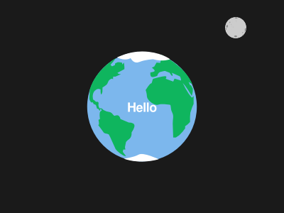

# <span class="emoji">📋</span> Changelog

This changelog *lists* the **changes** *compared* to the [first-site project](https://github.com/glmvc/first-site "first-site GitHub repository"), *including* **general changes** such as file structure and overall code style, as well as **modifications**, **adjustments**, **improvements**, **fixes**, **additions**, **removals**, and **upgrades** related to **files** and **code**.

In fact, there is *much more* to it than what can be seen and experienced between the [first-site](https://glmvc.github.io/first-site-upgrade/first-site/index.html "first-site version (different structure and layout)") and the [upgraded version of it here](https://glmvc.github.io/first-site-upgrade/index.html "first-site-upgrade homepage").

Best of all, there's *plenty more* to come! Take a look at the **"Future Features"** list right below.

---

## <span class="emoji">🚀</span> Future Features

- [ ] **Scroll-to-Top button <span class="emoji">🔝</span>**
- [ ] **Dark and Light Mode switcher <span class="emoji">🔦</span>**
- [ ] **Web form site <span class="emoji">🖋️</span>**
- [ ] **Automatic "Last upgraded" date and time** <span class="emoji">⏱️</span>

---

## <span class="emoji">⚙️</span> General

- [x] Use of **best practices** and *useful* **tools**, **libraries**, and **inspirations** - see the **[project's resources](https://github.com/glmvc/first-site-upgrade/blob/main/README.md#-resources "first-site-upgrade resources") <span class="emoji">📔</span>**
- [x] *Specially designed* and *consistent* **naming** and **structure** of folders, files, and code itself, i.e., for the entire project - see the **[project's style guide](https://github.com/glmvc/first-site-upgrade/blob/main/CONTRIBUTING.md#-style-guide "first-site-upgrade style guide") <span class="emoji">🎩</span>**
- [x] *Improved* **code information** and **structure** through *specially designed*, *consistent*, and *easily searchable* **comments <span class="emoji">📝</span>**
- [x] *Adapted* and *consistent* **code style** and **formatting** *handled* by **[Visual Studio Code settings](https://code.visualstudio.com/ "Visual Studio Code website") (`/.vscode/settings.json`)**, **[EditorConfig](https://editorconfig.org/ "EditorConfig website") (`/.editorconfig`)** and **[Prettier](https://prettier.io/ "Prettier website") (`/.prettierrc.yaml` and `/.prettierignore`) <span class="emoji">🪄</span>**
    - [x] **Default charset** *defined* as **`utf-8`**
    - [x] **Space indentation** *changed* from four to **two spaces**
    - [x] **Maximum line length** *set* to a modern standard of **120 characters**
    - [x] **Line endings** *normalized* and *specified* to unix-style **`lf`** (line feed)
    - [x] A **newline** *added* to the **end of each file**
    - [x] **Trailing whitespace** *trimmed*
- [x] *Recommended* **[Visual Studio Code extensions](https://code.visualstudio.com/docs/editor/extension-marketplace#_recommended-extensions "Visual Studio Code documentation article about the Extension Marketplace")** for working on the project - see **`/.vscode/extensions.json` <span class="emoji">📣</span>**

---

## <span class="emoji">&lt;/&gt;</span> HTML

- [x] **Semantic elements** and **attributes** *used* appropriately

- [x] **Text content** and **paragraphs** *adjusted* to the changes and *expanded* as needed

- [x] **Documents** *created* and *adapted* as needed for **additional sites** and **features**
    - [x] **[Source Code](https://glmvc.github.io/first-site-upgrade/code.html "first-site-upgrade Source Code site") (`/code.html`)**
    - [x] **[Changelog](https://glmvc.github.io/first-site-upgrade/changelog.html "first-site-upgrade Changelog site") (`/changelog.html`)**
    - [x] **[Site Not Found (404)](https://glmvc.github.io/first-site-upgrade/404.html "first-site-upgrade Site Not Found (404) site") (`/404.html`)**

### &lt;!DOCTYPE html&gt;

- [x] Document **language** *set* to **[English (US region)](https://r12a.github.io/app-subtags/?check=en-US "Language subtag lookup app")**:

    ```html
    <html lang="en-US">
    ```

- [x] Document **text directionality** *set* to **left-to-right**:

    ```html
    <html dir="ltr">
    ```

### &lt;head&gt;

- [x] Document **charset** (character encoding) *ensured to be located* within the **first 1024 bytes of the document**:

    ```html
    <meta charset="utf-8" />
    <!-- locate charset within the first 1024 document bytes -->
    ```

- [x] Document **title** *changed* to **"My Upgraded First Site"**:

    ```html
    <!-- @title -->
    <title>My Upgraded First Site</title>
    ```

- [x] Additional **website metadata** (description, keywords, author, viewport, theme color, [Windows Tiles](https://learn.microsoft.com/en-us/previous-versions/windows/internet-explorer/ie-developer/platform-apis/hh772707(v=vs.85) "Microsoft Pinned Sites documentation"), [Twitter Card](https://developer.twitter.com/en/docs/twitter-for-websites/cards/overview/abouts-cards "About Twitter Cards"), and [Open Graph](https://ogp.me/ "The Open Graph protocol")) *added*:

    ```html
    <!-- @metadata -->
    <meta name="description" content="The upgraded version of my first site!" />
    <meta name="keywords" content="first, site, upgrade, upgraded, version, glmvc, hello, world" />
    <meta name="author" content="glmvc" />
    <meta name="viewport" content="width=device-width, initial-scale=1.0" />
    <meta name="theme-color" content="#0fb55e" />
    <meta name="msapplication-TileColor" content="#00a300" />
    <meta name="msapplication-TileImage" content="mstile-144x144.png" />
    <meta name="msapplication-config" content="browserconfig.xml" />
    <meta name="twitter:card" content="summary_large_image" />
    <meta name="twitter:url" content="https://glmvc.github.io/first-site-upgrade/index.html" />
    <meta name="twitter:title" content="My Upgraded First Site" />
    <meta name="twitter:description" content="The upgraded version of my first site!" />
    <meta name="twitter:image" content="https://glmvc.github.io/first-site-upgrade/images/hello-world.png" />
    <meta name="twitter:image:alt" content="A cartoon view of the earth saying hello and the moon" />
    <meta name="twitter:site" content="@glmvc" />
    <meta name="twitter:creator" content="@glmvc" />
    <meta property="og:type" content="website" />
    <meta property="og:locale" content="en_US" />
    <meta property="og:url" content="https://glmvc.github.io/first-site-upgrade/index.html" />
    <meta property="og:title" content="My Upgraded First Site" />
    <meta property="og:description" content="The upgraded version of my first site!" />
    <meta property="og:image" content="https://glmvc.github.io/first-site-upgrade/images/hello-world.png" />
    <meta property="og:image:type" content="image/png" />
    <meta property="og:image:alt" content="A cartoon view of the earth saying hello and the moon" />
    <meta property="og:image:width" content="400" />
    <meta property="og:image:height" content="300" />
    <meta property="og:video" content="https://glmvc.github.io/first-site-upgrade/videos/hello-world.mp4" />
    <meta property="og:video:type" content="video/mp4" />
    <meta property="og:video:alt" content="A 'Hello world!' terminal output" />
    <meta property="og:video:width" content="640" />
    <meta property="og:video:height" content="360" />
    <meta property="og:audio" content="https://glmvc.github.io/first-site-upgrade/audios/cyberpunk.mp3" />
    <meta property="og:audio:type" content="audio/mpeg" />
    <meta property="og:audio:alt" content="A cyberpunk soundtrack" />
    ```

- [x] **Internal stylesheet** *added* (for demo purposes only):

    ```html
    <!-- @css -->
    <!-- internal stylesheet (for demo purposes only) -->
    <style>
      * {
        margin: 0;
        padding: 0;
      }
    </style>
    ```

- [x] **Link** to [Google's online font service](https://fonts.google.com/ "Google Fonts website") *replaced* with the **fonts stylesheet** that *includes* the **self-hosted fonts** *downloaded* using the **[google-webfonts-helper](https://gwfh.mranftl.com/fonts "google-webfonts-helper tool")**:

    ```html
    <link rel="stylesheet" href="styles/fonts.css" />
    ```

- [x] **Link** to the **[normalize stylesheet](https://necolas.github.io/normalize.css/ "Normalize.css website")** *added* to *"make browsers render all elements more consistently and in line with modern standards"*:

    ```html
    <link rel="stylesheet" href="styles/normalize.css" />
    ```

- [x] **Link** to the **main stylesheet** *ensured* to be **placed last** in terms of "regular" stylesheets:

    ```html
    <link rel="stylesheet" href="styles/style.css" />
    ```

- [x] **Links** for the **favicons** (generated by the [RealFaviconGenerator](https://realfavicongenerator.net/ "RealFaviconGenerator website") for multiple browsers and devices using emojis from [Twemoji](https://twemoji.twitter.com/ "Twemoji website") with the [Twemoji Cheatsheet](https://twemoji-cheatsheet.vercel.app/ "twemoji cheatsheet tool") and masked with the [Maskable.app](https://maskable.app/editor "Maskable.app Editor")) *added*:

    ```html
    <!-- @linking -->
    <link rel="icon" href="favicon-32x32.png" sizes="32x32" type="image/png" />
    <link rel="icon" href="favicon-16x16.png" sizes="16x16" type="image/png" />
    <link rel="icon" href="favicon.ico" sizes="any" />
    <link rel="icon" href="favicon.svg" type="image/svg+xml" />
    <link rel="apple-touch-icon" href="apple-touch-icon.png" sizes="180x180" />
    <link rel="mask-icon" href="safari-pinned-tab.svg" color="#0fb55e" />
    <link rel="manifest" href="site.webmanifest" />
    ```

- [x] **Scripts** for the **[jQuery](https://jquery.com/ "jQuery website")** and **[Image Map Resizer](https://github.com/davidjbradshaw/image-map-resizer "Image Map Resizer GitHub repository")** libraries *added*, and **script loading strategy** *changed* (within the `<head>` plus `defer` attribute):

    ```html
    <!-- @scripts -->
    <script src="scripts/jquery-3.6.4.min.js" defer></script>
    <script src="scripts/imageMapResizer.min.js" defer></script>
    <script src="scripts/main.js" defer></script>
    ```

- [x] **Link** to the **noscript stylesheet** *added* within `<noscript>` to *provide* **"visual warnings"** when **scripting is disabled** in the browser:

    ```html
    <noscript><link rel="stylesheet" href="styles/noscript.css" /></noscript>
    ```

- [x] **Stylesheets** and **script** for the **[Prism syntax highlighter library](https://prismjs.com/ "Prism website")** and its [VS Code Dark+ theme](https://github.com/PrismJS/prism-themes/blob/master/themes/prism-vsc-dark-plus.css "VS Code Dark+ theme CSS file on GitHub") *added* and *linked* in the **[Source Code](https://glmvc.github.io/first-site-upgrade/code.html "first-site-upgrade Source Code site") (`/code.html`)** and **[Changelog](https://glmvc.github.io/first-site-upgrade/changelog.html "first-site-upgrade Changelog site") (`/changelog.html`)** documents:

    ```html
    <link rel="stylesheet" href="styles/prism.min.css" />
    <link rel="stylesheet" href="styles/prism-theme.min.css" />
    ```

    ```html
    <script src="scripts/prism.min.js" defer></script>
    ```

- [x] **Script** for the **[Marked markdown compiler](https://marked.js.org/ "Marked website")** *added* in the **[Changelog](https://glmvc.github.io/first-site-upgrade/changelog.html "first-site-upgrade Changelog site") (`/changelog.html`)** document:

    ```html
    <script src="scripts/marked.min.js" defer></script>
    ```

### &lt;body&gt;

- [x] **Custom `data-*` attribute** *added* to the `<body>` for **identification of individual pages** (visual content in the documents):

    ```html
    <body data-page="home">
    ```

- [x] **Semantically named `id`** (unique per document) and **`class` attribute values** *added* for **identification of elements**:

    ```html
    <h3 id="web-dev-title" class="hyphenation">Web development</h3>
    ```

- [x] **Generic container** *added* as a direct child of the `<body>` for **layout styling purposes** of the **visual page content**:

    ```html
    <!--=====================================================-->
    <!-- || page -->
    <!--=====================================================-->
    <div class="page-wrapper centered">
      ...
    </div>
    ...
    ```

- [x] **Semantic elements** *historically employed* for **styling purposes** but *now holding* **semantic value** *used* with **informational** and **semantic `class` names**:

    ```html
    <b class="user-instruction">enable JavaScript</b>
    ```

    ```html
    <i class="latin-expression" lang="la">et cetera</i>
    ```

    ```html
    <u class="incorrect-spelling">helo wrodl</u>
    ```

- [x] **Semantic elements** for **sectioning content** *used*:

    ```html
    <!--=====================================================-->
    <!-- || header -->
    <header>
      ...
      <!-- || navigation (nav) -->
      <nav>
        ...
      </nav>
    </header>
    <!--=====================================================-->
    <!-- || main -->
    <main>
      ...
      <!-- || sidebar (aside) -->
      <aside>
        ...
      </aside>
      ...
      <!-- || [section name] -->
      <section>
        ...
      </section>
      ...
      <!-- || [article name] -->
      <article>
        ...
      </article>
    </main>
    <!--=====================================================-->
    <!-- || footer -->
    <footer>
      ...
      <!-- || contact details (address) -->
      <address>
        ...
      </address>
    </footer>
    ...
    ```

- [x] **Accessibility (A11y)** aspects *added* and *improved*, such as **skip links** and the use of **ARIA**:

    ```html
    <!--=====================================================-->
    <!-- || skip links (a11y) -->
    <div class="skip-links box-shadow">
      Skip to <a class="skip-link" href="#content-main">main content</a> or
      <a class="skip-link" href="#footer-main">main footer</a>.
    </div>
    ```

    ```html
    <a class="logo" href="index.html" aria-label="Home" aria-current="page">
      ...
    </a>
    ```

- [x] **Logo** *added* as an **inline SVG** within the `<header>` and an **anchor linking to the homepage**:

    ```html
    <!-- || logo (svg) -->
    <a class="logo" href="index.html" aria-label="Home" aria-current="page">
      <span class="visually-hidden">ivan glmvc</span>
      <svg
        xmlns="http://www.w3.org/2000/svg"
        width="244"
        height="265"
        fill="none"
        viewBox="0 0 244 265"
        role="img"
        aria-labelledby="svg-logo-title"
      >
        <title id="svg-logo-title">Logo with the letters "i" and "v" for the name "ivan"</title>
        <path
          fill="whitesmoke"
          fill-rule="evenodd"
          d="M53.8992 98.4712c5.7288-3.3137 13.0542-1.3472 16.3617 4.3928l71.8651 124.707c3.308 5.74 1.345 13.079-4.384 16.393-5.728 3.313-13.054 1.347-16.361-4.393L49.5151 114.864c-3.3075-5.74-1.3447-13.079 4.3841-16.3928ZM204.726 165.339c6.515 1.151 10.864 7.375 9.716 13.901l-7.973 45.302c-1.149 6.526-7.361 10.884-13.876 9.733-6.514-1.15-10.864-7.374-9.715-13.901l7.972-45.301c1.149-6.527 7.361-10.885 13.876-9.734Z"
          clip-rule="evenodd"
        />
        ...
      </svg>
      ...
    </a>
    ```

- [x] Two **generic inline containers** *added* after the inline SVG logo for text with a **[typewriter effect](https://www.30secondsofcode.org/css/s/typewriter-effect/ "30 seconds of code Typewriter effect article")**:

    ```html
    <!-- || typewriter effect -->
    <span class="typewriter" aria-hidden="true">
      <span class="js-typewriter-text"></span>
    </span>
    ```

- [x] **Navigation** *added* within the `<header>` with a **[toggle button](https://codepen.io/ahmadbassamemran/pen/VQwPGr "Hamburger Icons Animations by Ahmad Emran on CodePen")** for the **responsive navigation** and **anchors** within an **unordered list** *linking* to the **individual documents**:

    ```html
    <!-- || navigation (nav) -->
    <nav aria-label="Main">
      <button
        type="button"
        id="js-nav-toggle-button"
        class="nav-toggle-button"
        aria-controls="nav-main"
        aria-expanded="false"
      >
        <span class="visually-hidden">Open main navigation</span>
        <span></span>
        ...
      </button>
      <ul id="nav-main">
        <li><a class="nav-item-home active" href="index.html" title="Homepage" aria-current="page">Home</a></li>
        <li><a class="nav-item-code" href="code.html" title="Source Code">Code</a></li>
        <li><a class="nav-item-changelog" href="changelog.html" title="Changelog List">Changelog</a></li>
        <li>
          <a
            class="nav-item-first-site"
            href="first-site/index.html"
            title="first-site version (different structure and layout)"
            rel="alternate"
            >First-Site</a
          >
        </li>
      </ul>
    </nav>
    ```

- [x] **Button type** *set* for **buttons** that are *not associated* with forms or controls to *achieve* **no default behavior on activation**:

    ```html
    <button type="button">...</button>
    ```

- [x] **Warnings** *displayed* when **scripting is disabled** in the browser:

    ```html
    <!-- || noscript -->
    <noscript class="drop-shadow">
      Please <b class="user-instruction">enable JavaScript</b> in your (system/browser) settings to ensure that this
      website runs properly.
    </noscript>
    ```

- [x] **Sidebar** *added* for **hyperlinks** to **social media profiles**:

    ```html
    <!-- || sidebar (aside) -->
    <aside class="box-shadow drop-shadow">
      ...
    </aside>
    ```

- [x] **Advisory information** *added* to certain elements (*hovering* over some of them will *display* a **tooltip** in some browsers):

    ```html
    <a href="https://github.com/glmvc" title="glmvc GitHub profile">...</a>
    ```

    ```html
    <abbr title="Hypertext Markup Language">HTML</abbr>
    ```

- [x] **Outgoing hyperlinks** *adapted* to **open in a new tab** instead of the current one:

    ```html
    <a href="https://github.com/glmvc" target="_blank">...</a>
    ```

- [x] **Hyperlinks** *adapted* with **relationships** between the linked resource and the current document:

    ```html
    <a href="https://github.com/glmvc" rel="external noopener noreferrer">...</a>
    ```

- [x] **Character references** *used* for **special characters** like **emojis** and **non-breaking spaces**:

    ```html
    <a ...>&#128025;&nbsp;GitHub</a>
    ```

- [x] **Character entity references** *used* to **escape HTML syntax characters**:

    ```html
    &amp;
    &quot;
    &lt;
    &gt;
    ```

- [x] **Heading elements** *used* correctly by *not skipping* **heading levels**, *maintaining* a **logical document outline**, and *ensuring* the use of a **single main heading per document**:

    ```html
    <h1>...</h1>
      <h2>...</h2>
        <h3>...</h3>
        <h3>...</h3>
          <h4>...</h4>
        <h3>...</h3>
        <h3>...</h3>
          <h4>...</h4>
            <h5>...</h5>
          <h4>...</h4>
            <h5>...</h5>
              <h6>...</h6>
              <h6>...</h6>
      <h2>...</h2>
        <h3>...</h3>
    ```

- [x] **Main heading** *adjusted* by *adding* a **generic inline container** within for more control over **text styling**:

    ```html
    <h1><span class="heading-main">hello world!</span></h1>
    ```

- [x] **Inline styling** *added* to the **subheading** (for demo purposes only) and **possible bidirectional text** from the inserted username input *isolated* from the **preceding text**:

    ```html
    <!-- inline styling (for demo purposes only) -->
    <h2 style="color: whitesmoke; color: var(--on-surface-color-main)">
      Nice to meet you, <bdi class="hyphenation" data-name></bdi>
    </h2>
    ```

- [x] **Figures** and their **captions** *added* for the **switchable image**, **video**, and **audio**:

    ```html
    <figure>
      ...
      <figcaption>
        ...
      </figcaption>
    </figure>
    ```

- [x] **[Switchable image](https://openclipart.org/detail/190952/hello-world "Open Clipart image source")** *embedded* within its `<section>`, *assigned* **intrinsic dimensions**, *provided* with **multiple resolutions** using **pixel density descriptors**, *supplemented* with **advisory information** about being switchable, *linked* to an **image map** with **hyperlink areas** of specified shape and coordinates, and *made* **focusable**:

    ```html
    <figure>
      <map name="hello-world">
        <area
          alt="Planet Earth"
          href="#table-planets"
          title="Table about the planets in our solar system, including our home, the Earth"
          shape="circle"
          coords="200,150,78"
        />
        <area
          alt="Earth's Moon"
          href="https://solarsystem.nasa.gov/moons/earths-moon/overview/"
          title="NASA's solar system site about Earth's Moon"
          target="_blank"
          rel="external noopener noreferrer"
          shape="circle"
          coords="332,39,15"
        />
      </map>
      
      <figcaption>
        The earth saying hello and the moon (image downloaded from
        <a
          href="https://openclipart.org/detail/190952/hello-world"
          title="Open Clipart image source"
          target="_blank"
          rel="external noopener noreferrer"
          >Open Clipart</a
        >)
      </figcaption>
    </figure>
    ```

- [x] **[Video](https://pixabay.com/videos/hello-world-pc-retro-monitor-28320/ "Pixabay video source")** *embedded* within the `<article>`, *assigned* **intrinsic dimensions**, *supplemented* with a **poster** and **controls**, *played* in a **loop** and **automatically**, *provided* in **multiple formats** (**`WebM`** and **`MPEG-4`**-**`MP4`**) with the corresponding **codecs** (**`AV1`** and **`AVC`**-**`H.264`**), *described* with a **description** using the **`WebVTT` format**, and *enhanced* with a **fallback text** and **hyperlink to the video file**:

    ```html
    <figure class="centered">
      <video
        class="centered box-shadow"
        width="400"
        height="225"
        poster="images/hello-world-video-poster.jpeg"
        controls
        loop
        muted
        playsinline
        autoplay
      >
        <source src="videos/hello-world.webm" type="video/webm; codecs=av01.0.08M.08.0.110.06.06.06.0" />
        <source src="videos/hello-world.mp4" type="video/mp4; codecs=avc1.4D0028" />
        <track kind="descriptions" src="videos/hello-world.vtt" srclang="en-US" label="English (US)" />
        <p>
          Sorry, your browser doesn't support HTML 5 video. But don't worry, here's a
          <a href="videos/hello-world.mp4" title="'Hello world!' terminal output MP4 video file" target="_blank"
            >link to the MP4 video file</a
          >
          instead. You can download it and watch it with your favorite video or media player!
        </p>
      </video>
      <figcaption>
        A 'Hello world!' terminal output (video downloaded from
        <a
          href="https://pixabay.com/videos/hello-world-pc-retro-monitor-28320/"
          title="Pixabay video source"
          target="_blank"
          rel="external noopener noreferrer"
          >Pixabay</a
        >)
      </figcaption>
    </figure>
    ```

- [x] **[Audio](https://pixabay.com/music/electronic-cyberpunk-2099-10701/ "Pixabay audio source")** *embedded* within the `<footer>`, *supplemented* with **controls**, *played* in a **loop**, *indicated* to the browser that the **whole file can be downloaded**, *provided* in **multiple formats** (**`Ogg`** and **`MPEG-1 Audio Layer 3`**-**`MP3`**) with the corresponding **codecs** (**`Vorbis`**), *described* with a **description** using the **`WebVTT` format**, and *enhanced* with a **fallback text** and **hyperlink to the audio file**:

    ```html
    <figure>
      <audio id="audio" class="box-shadow" controls loop preload="auto">
        <source src="audios/cyberpunk.ogg" type="audio/ogg; codecs=vorbis" />
        <source src="audios/cyberpunk.mp3" type="audio/mpeg" />
        <track kind="descriptions" src="audios/cyberpunk.vtt" srclang="en-US" label="English (US)" />
        <p>
          Sorry, your browser doesn't support HTML 5 audio. But don't worry, here's a
          <a href="audios/cyberpunk.mp3" title="Cyberpunk soundtrack MP3 audio file" target="_blank"
            >link to the MP3 audio file</a
          >
          instead. You can download it and listen to it with your favorite audio or media player!
        </p>
      </audio>
      <figcaption>
        A cyberpunk soundtrack (audio downloaded from
        <a
          href="https://pixabay.com/music/electronic-cyberpunk-2099-10701/"
          title="Pixabay audio source"
          target="_blank"
          rel="external noopener noreferrer"
          >Pixabay</a
        >)
      </figcaption>
    </figure>
    ```

- [x] **Citation** and **quotations** *added* and *linked* accordingly:

    ```html
    <p>
      According to the
      <cite
        ><a
          href="https://en.wikipedia.org/wiki/%22Hello,_World!%22_program"
          title="'Hello, World!' program - Wikipedia entry"
          target="_blank"
          rel="external noopener noreferrer"
          >Wikipedia article on the "Hello, World!" program</a
        ></cite
      >.
    </p>
    ```

    ```html
    <blockquote cite="https://en.wikipedia.org/wiki/%22Hello,_World!%22_program">
      ...
    </blockquote>
    ```

    ```html
    <p>
      <q cite="https://en.wikipedia.org/wiki/HTML"
        ><abbr title="Hypertext Markup Language"><strong>HTML</strong></abbr> is the standard markup language for
        documents designed to be displayed in a web browser.</q
      >
    ...
    ```

- [x] **Importance** and **emphasis** *added* to certain **words** and **parts of text**:

    ```html
    <strong>...</strong>
    ```

    ```html
    <em>...</em>
    ```

- [x] **Relevant** and **interesting text content** *marked* and *highlighted*:

    ```html
    <mark>...</mark>
    ```

- [x] **Line breaks** (carriage returns) *used* to **structure text** for **visual separation** and **improved readability**:

    ```html
    ...
    ...<br />
    ...
    ```

- [x] **Horizontal rules** *added* for **thematic breaks**:

    ```html
    ...
    <hr />
    ...
    ```

- [x] **Description list** *added* within its `<section>` to *describe* **terms** with corresponding **descriptions** and **definitions**:

    ```html
    <dl>
      <dt>
        <dfn>...</dfn>
      </dt>
      <dd>
        ...
      </dd>
      ...
    </dl>
    ```

- [x] **Unordered list** *nested* to *create* **hierarchical list content** within its `<section>`:

    ```html
    <ul>
      <li>
        ...
        <ul>
          <li>...</li>
          <li>...</li>
        </ul>
      </li>
      <li>
        ...
      </li>
    </ul>
    ```

- [x] **Further sources** *added* to the **ordered list**, which is *split* into **two parts** within its `<section>`:

    ```html
    <ol>
      <li>...</li>
      <li>...</li>
      ...
    </ol>
    ...
    <ol start="11">
      <li>...</li>
    </ol>
    ```

- [x] **Abbreviations** *added* for **acronyms** and to *abbreviate* **terms**:

    ```html
    <abbr title="Hypertext Markup Language">HTML</abbr>
    ```

- [x] **Comprehensive table** *added* within its `<section>` that *contains* **data** about the **planets of our solar system** and *includes* a **caption**, **headers**, **column** and **row groups**, and a **footer note**:

    ```html
    <div class="table-wrapper drop-shadow">
      <div class="table-scroll">
        <table>
          <caption>...</caption>
          <colgroup>
            <col span="2" />
            <col span="1" />
            <col span="9" />
          </colgroup>
          <thead>
            <tr>
              <th id="..." colspan="2" scope="colgroup">...</th>
              <th id="..." scope="col">...</th>
              <th id="..." scope="col" abbr="...">...</th>
              ...
            </tr>
          </thead>
          <tbody>
            <tr>
              <th id="..." colspan="2" rowspan="4" scope="rowgroup" headers="...">...</th>
              <th id="..." scope="row" headers="...">...</th>
              <td headers="...">...</td>
              ...
            </tr>
            <tr>
              <th id="..." scope="row" headers="...">...</th>
              <td headers="...">...</td>
              ...
            </tr>
            ...
          </tbody>
          <tfoot>
            <tr>
              <td colspan="12">...</td>
            </tr>
          </tfoot>
        </table>
      </div>
    </div>
    ```

- [x] **User input** from **text entry devices** such as **keyboards** *added* in the **[Source Code](https://glmvc.github.io/first-site-upgrade/code.html "first-site-upgrade Source Code site")** document for **shortcuts** and **terminal commands**:

    ```html
    <kbd><kbd>&#8984; (Command/Cmd)</kbd> + <kbd>V</kbd></kbd> on Mac or
    <kbd><kbd>Ctrl (Control)</kbd> + <kbd>V</kbd></kbd> on Windows/Linux.
    ```

    ```html
    <samp><kbd>whois 185.199.108.153</kbd>
    ...</samp>
    ```

- [x] **Sample output** from the **terminal** *added* in the **[Source Code](https://glmvc.github.io/first-site-upgrade/code.html "first-site-upgrade Source Code site") (`/code.html`)** document to *demonstrate* **shell interactions**:

    ```html
    <samp>...</samp>
    ```

- [x] **Source code** *implemented* as **code blocks/snippets** in the **[Source Code](https://glmvc.github.io/first-site-upgrade/code.html "first-site-upgrade Source Code site") (`/code.html`)** and **[Changelog](https://glmvc.github.io/first-site-upgrade/changelog.html "first-site-upgrade Changelog site") (`/changelog.html`)** documents by *fetching* and *highlighting* the **source files** and **code** using the **[Prism syntax highlighter library](https://prismjs.com/ "Prism website")**:

    ```html
    <pre data-src="index.html"></pre>
    ```

    ```html
    <pre><code class="language-...">...</code></pre>
    ```

- [x] **JavaScript variable** for the **"first site visit check"** *introduced* and *explained* in the **[Source Code](https://glmvc.github.io/first-site-upgrade/code.html "first-site-upgrade Source Code site") (`/code.html`)** document:

    ```html
    <var>firstSiteVisit</var>
    ```

- [x] **User interaction features** like the **"Change user" button** *added* within the `<footer>`:

    ```html
    <!-- || site features -->
    <h4>Features</h4>
    <h5>user interaction</h5>
    <div class="features-wrapper">
      <div class="feature">
        <h6>Change your username:</h6>
        <button type="button" id="js-change-username" class="button">Change user</button>
      </div>
      ...
    </div>
    ```

- [x] **Contact details (fake)** *added* within the `<footer>` as an **address** with **special anchors** for a **telephone number** and **email**:

    ```html
    <!-- || contact details (address) -->
    <address>
      <div class="contact-details">
        <p>
          secret company contact:<br />
          secret street 1<br />
          secret city<br />
          secret country
        </p>
        <a href="tel:+1234567890">123-456-7890</a>
        <a
          href="mailto:secret@example.com?cc=office@example.com,info@example.com&bcc=mail@example.com&subject=***%20Secret%20Subject%20***&body=***%20Secret%20Message%20***"
          >secret@example.com</a
        >
      </div>
      ...
    </address>
    ```

- [x] **Contact map** showing a location *embedded* within the `<address>` as an **iframe** from **[OpenStreetMap](https://www.openstreetmap.org/about "OpenStreetMap about page")**:

    ```html
    <iframe
      name="contact-map"
      class="box-shadow"
      width="400"
      height="300"
      src="https://www.openstreetmap.org/export/embed.html?bbox=-116.8620014190674%2C37.62317153081475%2C-116.83492183685304%2C37.63501637743219&amp;layer=mapnik"
      title="Secret location on OpenStreetMap"
      loading="lazy"
    ></iframe>
    ```

- [x] **Additional content** and **information about the site** *added* within the `<footer>` in a **details area** with a **summary caption**:

    ```html
    <!-- || info (details) -->
    <details open>
      <summary class="centered">Info</summary>
      ...
    </details>
    ```

- [x] **Japanese phrase** with the language *set* to **Japanese** *added* within the `<details>`:

    ```html
    <p lang="ja">愛を込めて作成されました。</p>
    ```

- [x] **Date** and **time** *added* for the **birthday** and **last upgrade** within the `<details>` in a **machine-readable format**:

    ```html
    <time id="birthday" datetime="YYYY-MM-dd">...</time>
    ```

    ```html
    <time id="js-last-upgraded" datetime="YYYY-MM-ddThh:mm">...</time>
    ```

- [x] **Superscript** *added* for **exponents** within the `<table>` and **ordinal numbers** within the `<details>`:

    ```html
    <th scope="col">Density (kg/m<sup>3</sup>)</th>
    ```

    ```html
    6<sup>th</sup> of December 2021
    ```

- [x] **Subscript** *added* for the **chemical formula** within the `<details>`:

    ```html
    C<sub>8</sub>H<sub>10</sub>N<sub>4</sub>O<sub>2</sub>
    ```

- [x] **Data value** *used* to *provide* the **content** of the **chemical formula** in a **machine-readable translation**:

    ```html
    <data value="caffeine">C<sub>8</sub>H<sub>10</sub>N<sub>4</sub>O<sub>2</sub></data>
    ```

- [x] **Text directionality** *overridden* to **right-to-left** to *display* the **backward spelling** of two words within the `<details>`:

    ```html
    <bdo dir="rtl">Hello World</bdo>
    ```

- [x] **Deleted** and **inserted text** *used* to *correct* **misspellings** of two words within the `<details>`:

    ```html
    <del>helo wrodl</del> <ins>Hello World</ins>
    ```

- [x] **Line break opportunities** *used* to *introduce* **word break positions within text** for a **long example URL** within the `<details>`:

    ```html
    http://a<wbr />.super<wbr />.secret<wbr />.example<wbr />.info/located<wbr />/very<wbr />/deep<wbr />/within<wbr />/an<wbr />/extremely<wbr />/nested<wbr />/folder<wbr />/structure
    ```

- [x] **Side comments** *added* as **small print** for the **tagline** and **"Last upgraded" information** within the `<details>`:

    ```html
    <small>...</small>
    ```

- [x] **Mathematical symbol** for **infinity** *added* as part of the **tagline** using **`MathML`** and the corresponding **character reference name**:

    ```html
    <math><mi>&infin;</mi></math>
    ```

- [x] **Ruby annotation** *added* as part of the **tagline** to *display* **Romaji transliteration** for the **Japanese Kanji characters**:

    ```html
    <ruby>またね<rp>(</rp><rt>ma-ta-ne</rt><rp>)</rp></ruby>
    ```

- [x] **Dialog** *added* as an **Easter egg** that *appears* on the **birthday** of the **site**:

    ```html
    <!--=====================================================-->
    <!-- || birthday banner (dialog) -->
    <dialog id="birthday-banner" inert>
      ...
    </dialog>
    ```

- [x] **Canvas** with a **displayed size** and **fallback text** *added* within the `<dialog>` for **confetti animations** using the **[Canvas Confetti library](https://www.kirilv.com/canvas-confetti/ "Canvas Confetti website")**:

    ```html
    <canvas id="banner-confetti" width="762" height="518" aria-describedby="banner-confetti-description">
      <span id="banner-confetti-description">Confetti shower to celebrate the Bitday</span>
    </canvas>
    ```

- [x] **Heading with related content** *grouped* within the `<dialog>`:

    ```html
    <hgroup>
      <h3>Hooray! Today, the site turned <span class="js-site-age"></span> old!</h3>
      <p>And it's been that long since the very first bit of it was written.</p>
    </hgroup>
    ```

- [x] **Menu** *used* as an **unordered list** for **interactive buttons** within the `<dialog>`:

    ```html
    <menu>
      <li>
        <button type="button" class="js-close-dialog dialog-button box-shadow" autofocus>Close dialog</button>
      </li>
      <li>
        <button
          type="button"
          class="js-celebrate-birthday dialog-button box-shadow"
          aria-describedby="banner-confetti-description"
        >
          Celebrate with us <span class="emoji">&#129395;</span>
        </button>
      </li>
    </menu>
    ```

- [x] **Script** *added* as the **last element** right before closing the `<body>` to *output* an **informational message** to the **console**:

    ```html
    <!--=====================================================-->
    <!-- || body script -->
    <!--=====================================================-->
    <script>
      console.info("Hello, World!");
    </script>
    ```

---

## <span class="emoji">&#123;&#125;</span> CSS

- [x] `@font-face` rulesets in the created external stylesheet (`fonts.css`) *now in use* to *include* and *load* the **web fonts** that are used (eot, woff2, woff, ttf, svg and variable):

    ```css
    @font-face {...}
    ```

- [x] **External stylesheets**, **internal stylesheet** and **inline styling** *added* (internal and inline styling just for demonstration)

- [x] Default **margin** and **padding** *set* to 0 ("reset stylesheet") with the internal stylesheet using the universal selector (`*`):

    `* {margin: 0; padding: 0;}`

- [x] **Type** (tag / element), **class** and **ID selectors** *now in use*

- [x] **Selector lists** (bad practice as an example too) *now in use*

- [x] **Descendant**, **child**, **adjacent** and **general sibling combinators** *now in use*:

    ` `, `>`, `+` and `~`

- [x] CSS **functions** *now in use*

- [x] **Calc functions** *now in use* to perform calculations:

    `calc(...)`

- [x] **Natural** (intrinsic) and **extrinsic** (given size) sizes of elements *now in use*

- [x] More **values** and **units** *now in use* (absolute and relative lengths, percentages, numbers etc.)

- [x] Different **color values** *now in use* (rgb / rgba, hexadecimal, color keywords etc.)

- [x] Global website **colors** and **spacings** *set* with variables using the `:root` pseudo-class:

    `:root {...}`

- [x] Standard box model (`content-box`) *changed* to the **alternative box model** (`border-box`) for all elements in the document:

    `html {box-sizing: border-box;}`

    `*, *::before, *::after {box-sizing: inherit;}`

- [x] **Font size** of the `html` element *set* to 62.5% (because it's equal to 10px in most browsers) to make it easier to calculate `rem` units:

    `html {font-size: 62.5%;}`

- [x] **Font sizes** *adapted* to a fluid typography scale using `clamp` functions:

    `font-size: clamp(8.4rem, 7.8rem + 1.875vw, 10.5rem);`

- [x] Special pseudo-element for styling **selections** / **highlighting** *now in use*:

    `::selection`

- [x] Special pseudo-element for styling **marker boxes** *now in use*:

    `::marker`

    `summary::marker`

- [x] **Horizontal overflow** *set* to hidden on the `body` element because of unwanted horizontal scrolling especially on mobile devices:

    `overflow-x: hidden;`

- [x] **Backgrounds** *added* (background shorthand and longhand properties)

- [x] **Borders** *added* (border shorthand and longhand properties)

- [x] **Fallback width** for the `.page-wrapper` container *added* for browsers that do not support the `vw` unit:

    `width: 90%;`

- [x] **Green shadow** *styled* left and right of the `.page-wrapper` container:

    `box-shadow: 5px 0 10px rgba(15, 181, 94, 0.8), -5px 0 10px rgba(15, 181, 94, 0.8);`

- [x] **Utility classes** and **rulesets** *created* for repeating CSS tasks like horizontal centering of elements for example:

    `.center {margin-right: auto; margin-left: auto;}`

- [x] **Scrollbars** (both vertical and horizontal) *styled* using WebKit extensions:

    `.styled-scrollbars::-webkit-scrollbar {...}`

    `.styled-scrollbars::-webkit-scrollbar-track {...}`

    `.styled-scrollbars::-webkit-scrollbar-thumb {...}`

    `.styled-scrollbars::-webkit-scrollbar-thumb:hover {...}`

- [x] **Transitions** *now in use*:

    `transition: <property> <duration> <timing-function>;`

- [x] **Mouse cursor type** *changed* accordingly and as needed:

    `cursor: not-allowed;`

    `cursor: help;`

    `cursor: pointer;`

    `cursor: crosshair;`

- [x] **Text content** *styled* (headings, paragraphs, lists, captions, quotes etc.)

- [x] **Hyperlinks** *styled* with pseudo-class selectors:

    `a:link`, `a:visited`, `a:focus`, `a:hover` and `a:active`

- [x] SVG icon *attached* to **external hyperlinks** with an attribute selector and a special pseudo-element selector:

    `a[href*="http"]::after`

- [x] **Visual** / **functional content** *styled* (images, table, button etc.)

- [x] Website **layout** *styled* (using flex, grid, multicol, positioning, floating etc.)

- [x] **Animations** using `@keyframes` at-rules *now in use* for the glitch, typewriter and blinking caret effect:

    `animation: glitch 600ms infinite;`

    `animation: typing 6s steps(var(--characters)) infinite;`

    `animation: blink 1s step-end infinite;`

- [x] `@supports` at-rule *now in use* to specify declarations that depend on a browser's **support for a specific CSS feature**:

    `@supports not ((position: -webkit-sticky) or (position: sticky)) {..}`

    `@supports not (inset: 0) {...}`

- [x] **Main heading wrapper** (`div.heading`) and **images** *will now rotate* a bit on hover:

    `transform: rotate(-1deg);`

    `transform: rotate(0.005turn);`

- [x] **Main heading** (`<h1>`) *set* as inline box (outer display type) so that the click easter egg really only affects the text and not the full width / block:

    `display: inline;`

- [x] **Main heading** (`<h1>`) *wrapped* in a `div` container with the class `.heading` to center it:

    `div.heading {text-align: center;}`

- [x] **Subheading** (`<h2>`) **color** *set* to `whitesmoke` with inline styling (just for demonstration):

    `style="color: whitesmoke;"`

- [x] **Blur filter** *added* to the JavaScript code image to hide the click easter egg:

    `filter: blur(5px);`

- [x] **Writing modes** (block and inline dimensions) *changed* to vertical left-to-right for the sidebar and vertical right-to-left for the Japanese sentence:

    `writing-mode: vertical-lr;`

    `writing-mode: vertical-rl;`

- [x] **Borders of the table** *styled* to collapse:

    `table {border-collapse: collapse;}`

- [x] **Caption of the table** *positioned* to the bottom (visually):

    `table caption {caption-side: bottom;}`

- [x] *Adjusted* how **whitespace** and **word breaking** / **wrapping** are treated:

    `white-space: nowrap;`

    `word-wrap: break-word;`

    `overflow-wrap: break-word;`

- [x] The website *is now* **full responsive** (using media queries, meta viewport, layout techniques etc.)

- [x] Website *styled* to be **printable**:

    `@media print {...}`

- [x] Users who set the settings to **minimize the amount of non-essential motion** *are respected* by turning off all animations, transitions and the like:

    `@media (prefers-reduced-motion: reduce) {...}`

- [x] **Vendor prefixes** *added* with the [Autoprefixer CSS online tool](https://autoprefixer.github.io/ "Autoprefixer CSS online tool website") for optimal compatibility / browser support

---

## <span class="emoji">&#125;&#041;&#59;</span> JS

- [x] [jQuery library](https://jquery.com/ "jQuery website") *now in use* and most code in `main.js` rewritten using its syntax

- [x] [Prism syntax highlighter library](https://prismjs.com/ "Prism website") *now in use* for the created source code (`code.html`) and changelog (`changelog.html`) documents

- [x] At a **given scrolling value** (defined in the `checkScroll` function) the class `scrolled` *is now set* on the `body` element:

    ```js
    if ($(window).scrollTop() > 23) {$('body').addClass('scrolled');}
    ```

    `else {$('body').removeClass('scrolled');}`

- [x] The `checkScroll` function is *called* on the document `scroll` event:

    `$(window).on('scroll', function () { checkScroll(); });`

- [x] A **variable** and HTML and CSS **logic** for the text of the typewriter effect *declared*:

    `const text = 'glmvc';`

    `$('#typewriter-text').html(text);`

    `$('#typewriter-text').css('--characters', text.length + 6);`

- [x] Clicking on the **navigation icon** (`button`) will *toggle* the class `open` to it and the class `nav-open` to the `body` element:

    `$(this).toggleClass('open');`

    `$('body').toggleClass('nav-open');`

- [x] Clicking on the **navigation icon** (`button`) will also *change* the `aria-expanded` attribute accordingly:

    `let isExpanded = $(this).attr('aria-expanded');`

    `if (isExpanded === 'false') {$(this).attr('aria-expanded', 'true');}`

    `else {$(this).attr('aria-expanded', 'false');}`

- [x] The **username input** for the **personalized welcome message** *is now limited* to a certain number of characters:

    `let maxLength = 50;`

    `let userName = -1;`

    `while (userName == -1 || (userName != null && userName.length > maxLength)) { userName = window.prompt(...) }`

- [x] [Image Map Resizer library](https://github.com/davidjbradshaw/image-map-resizer/ "Image Map Resizer GitHub repository") *now in use* so that the image map works responsive:

    `$('map').imageMapResize();`

- [x] **Image map** and **figure caption** *now changing* accordingly on clicking the images:

    `let imageMap;` declares global variable

    `imageMap = $('map').detach();` inside the if statement: removes the map element from the dom, but keeps its data

    `$('img').before(imageMap);` inside the else statement: restores the map element with its data before the img element

    `$('img + figcaption').html('...');` inside the if and else conditional statements: for the correct figure caption

- [x] **Audio volume** of the `audio` element *set* to 50%:

    `let audio = document.getElementById('audio');`

    `audio.volume = 0.5;`

- [x] **Birthday banner** *added* to show on December 6 every year as a small easter egg using date comparison and the `dialog` element
